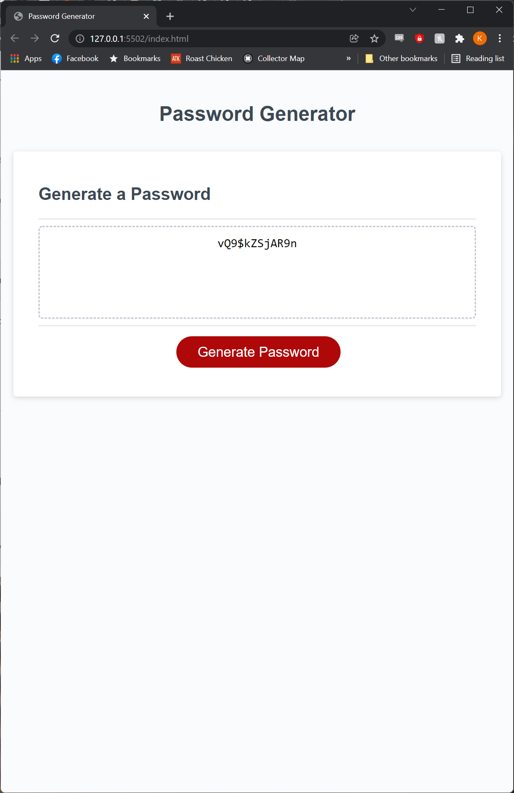

# Random Password Generator Project

For this project, we were given starter code for a site intended to randomly generate a password based on a set of criteria from a user, specifically:
- How long they want the generated password to be
- Whether or not they want the password to include lower case letters
- Whether or not they want the password to include upper case letters
- Whether or not they want the password to include numbers
- Whether or not they want the password to include special characters

The code was written to first determine how long the password would be, subsequently adding at least one of each type of character that the user wants included in the password before generating the rest of the password based on a string of every type of character they want included.

[Link to deployed application](https://kevinjwilkerson.github.io/Random-Password-Generator/)

# Screenshot
